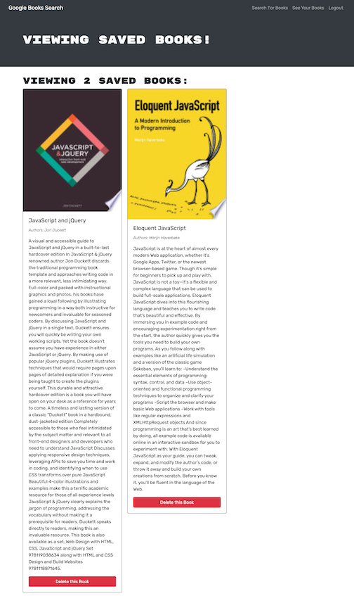

# 21 MERN: Book Search Engine

[Deployed Application](https://mern-book-find.herokuapp.com/)
## Description

This Google Books API search engine built with a RESTful API, was refactor to be a GraphQL API built with Apollo Server. The app was built using the MERN stack with a React front end, MongoDB database, and Node.js/Express.js server and API. Apollo Server was setup to use GraphQL queries and mutations to fetch and modify data, replacing the existing RESTful API. The existing authentication middleware was modified so that it works in the context of a GraphQL API. An Apollo Provider was created so that requests can communicate with an Apollo Server.

## Table of Contents

- [Installation](#installation)
- [Usage](#usage)
- [License](#license)
- [Contributors](#contributors)
- [Tests](#tests)
- [Questions](#questions)

## Installation
To install the necessary dependencies for this application, open up the terminal at the root then run `npm install`.

## Usage
To deploy the text editor, follow this [link](https://mern-book-find.herokuapp.com/). 

To deploy from VS Code, clone the [repo](https://github.com/jmotto/Book-Find), install the dependencies, run the command `npm run develop`.

* Sign Up by clicking "Login/Sign Up" at top right corner.
* Search for any book 
* Click the "Save this Book!" button to add to your book list
* To view your books click "See Your Books" in navbar
* To delete books click "delete this book" button
* Logout using "Logout" button in navbar

## License
This application is licensed under [MIT]((https://opensource.org/licenses/MIT)). 
  Copyright &copy; 2022 Jamie Otto

## Contributors
Jamie Otto

## Tests
Tests are not required.
## Questions
If you have any questions about this project, please contact [jmotto31@gmail.com](mailto:jmotto31@gmail.com). To view more of my projects, go to [jmotto](https://github.com/jmotto).